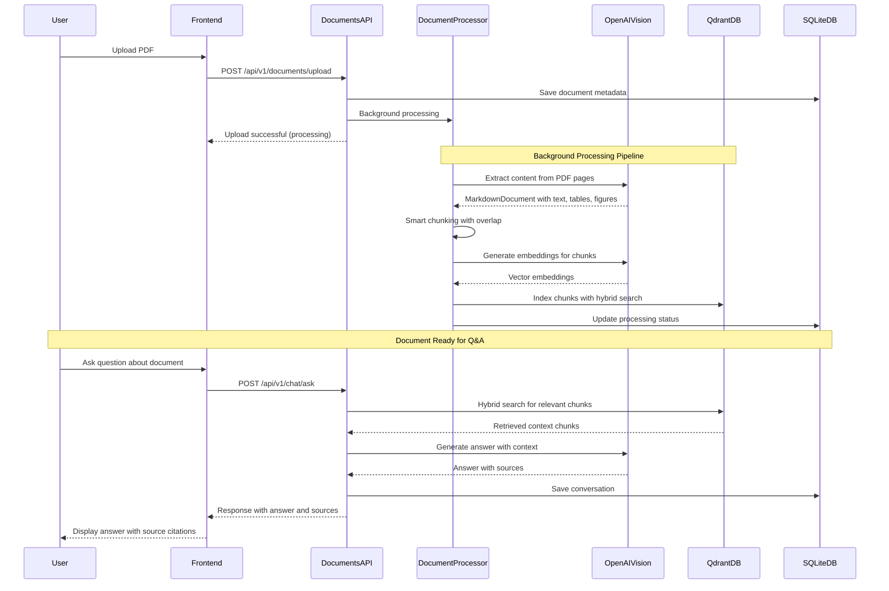

# AskMyDocs

**Transform your documents into intelligent conversations.**

AskMyDocs is an AI-powered document intelligence platform that lets you upload PDFs and interact with them through natural language. Ask questions, get instant answers, and discover insights from your documents.

---

## Getting Started

### Prerequisites

Before you begin, ensure you have:
- **Python 3.9+** and **Node.js 18+** installed
- An **OpenAI API key** for document processing

### Installation

```bash
# Clone the repository
git clone https://github.com/kaushikb11/AskMyDocs.git
cd AskMyDocs

# Backend setup
cd backend
python -m venv venv
source venv/bin/activate  # Windows: venv\Scripts\activate
pip install -r requirements.txt

# Configure environment
# Create backend/.env with:
OPENAI_API_KEY=your_openai_api_key_here
DEBUG=true

# Frontend setup
cd ../frontend
npm install

# Launch the application
# Terminal 1 - Start backend server:
cd backend && python main.py

# Terminal 2 - Start frontend client:
cd frontend && npm run dev
```

**Your application is ready:**
- **Frontend Interface:** http://localhost:5173
- **API Server:** http://localhost:8000
- **API Documentation:** http://localhost:8000/docs

---

## Architecture

```
AskMyDocs/
├── backend/                 # FastAPI server architecture
│   ├── main.py             # Application entry point
│   ├── routes/             # RESTful API endpoints  
│   ├── utils/              # Document processing & AI integration
│   ├── db/                 # Database models & operations
│   └── dto/                # Request/response schemas
├── frontend/               # React client application
│   ├── src/
│   │   ├── components/     # Reusable UI components
│   │   ├── hooks/          # Custom React hooks
│   │   └── lib/            # API client & utilities
└── README.md              # You are here
```

---

## Processing Flow

The platform follows a document processing pipeline that transforms PDFs into intelligent, queryable knowledge bases:



**Key Processing Stages:**

1. **Document Upload & Storage** - Secure PDF upload with metadata extraction
2. **Vision-Based Extraction** - GPT-4.1 Vision API extracts structured content (text, tables, figures)
3. **Smart Chunking** - Intelligent content segmentation with semantic boundaries  
4. **Vector Indexing** - Hybrid search setup with dense and sparse embeddings
5. **Conversational Interface** - Natural language Q&A with precise source attribution

---

## Core Features

**Document Intelligence**
Upload PDFs and let AI extract, analyze, and understand your content with advanced vision processing.

**Conversational Interface**  
Ask questions in natural language and receive contextual answers with precise source citations.

**Smart Search**
Combines vector similarity search with keyword matching for the most relevant results.

**Modern Experience**
Built with React and Tailwind CSS for a clean, responsive, and intuitive user interface.

---

## Configuration

### Backend Environment

Create `backend/.env`:

```bash
# Required
OPENAI_API_KEY=sk-your-openai-key

# Optional - Vector Database
QDRANT_URL=https://your-qdrant-cluster    # Uses local instance if not provided
QDRANT_API_KEY=your-qdrant-api-key       # Required only for cloud instances

# Optional - Server Settings
DEBUG=false
HOST=0.0.0.0
PORT=8000
```

### Frontend Environment

Create `frontend/.env`:

```bash
VITE_API_BASE_URL=http://localhost:8000
```
