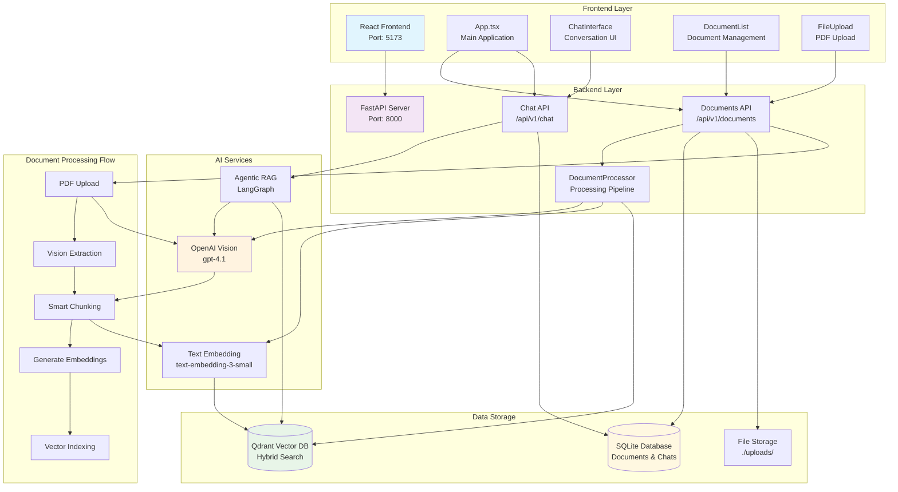

# System Architecture Overview

This document provides a comprehensive overview of the Document Intelligence Platform architecture, showing how the frontend, backend, AI services, and data storage layers interact.

## High-Level Architecture

## Architecture Components

### Frontend Layer
- **React Frontend**: Modern SPA built with React 19, TypeScript, and Tailwind CSS
- **Main Application**: Central App.tsx component managing view states and routing
- **Chat Interface**: Real-time conversation interface with session support
- **Document Management**: List, upload, and manage PDF documents
- **File Upload**: Drag-and-drop PDF upload with validation

### Backend Layer
- **FastAPI Server**: High-performance async Python web framework
- **Documents API**: RESTful endpoints for document management and processing
- **Chat API**: Conversational endpoints with agentic RAG integration
- **Document Processor**: Orchestrates the complete document processing pipeline

### AI Services
- **OpenAI Vision**: GPT-4.1 for advanced PDF content extraction
- **Agentic RAG**: LangGraph-powered intelligent document querying
- **Text Embedding**: OpenAI embeddings for semantic search

### Data Storage
- **SQLite Database**: Document metadata, conversations, and chat history
- **Qdrant Vector DB**: High-performance vector search with hybrid capabilities
- **File Storage**: Local filesystem storage for uploaded PDFs

## Key Features

1. **Intelligent Document Processing**: Vision-based PDF extraction with structured content parsing
2. **Hybrid Search**: Combines semantic and keyword search for optimal retrieval
3. **Conversational AI**: Session-based chat with document context awareness
4. **Real-time Processing**: Background document processing with status tracking
5. **Modern UI/UX**: Responsive design with dark/light theme support

## Technology Stack

### Frontend
- React 19 + TypeScript
- Tailwind CSS + Shadcn UI
- Vite build system
- React Query for state management

### Backend
- Python 3.9+ with FastAPI
- SQLModel for database ORM
- Pydantic for data validation
- LangGraph for agentic workflows

### AI & Data
- OpenAI GPT-4.1 Vision API
- Qdrant vector database
- LangChain for AI orchestration
- PyMuPDF for PDF processing 
