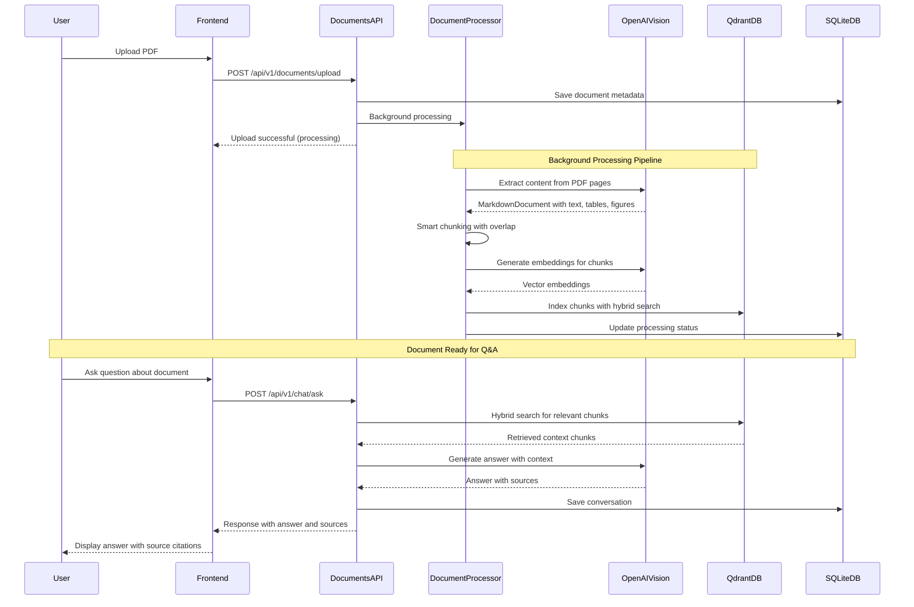

# Document Processing Pipeline

This document details the complete document processing pipeline from PDF upload to searchable content indexing.

## Processing Flow Sequence



## Detailed Processing Steps

### 1. PDF Upload & Validation
- **File validation**: PDF format, size limits (50MB max)
- **Metadata extraction**: File size, page count, MIME type
- **Database record**: Create document entry with PENDING status
- **File storage**: Save to `./uploads/` directory with UUID filename

### 2. Vision-Based Content Extraction
- **PDF to Images**: Convert each page to high-quality PNG (150 DPI)
- **OpenAI Vision API**: Extract structured content using GPT-4.1 Vision
- **Content Types**:
  - **Text**: Clean markdown with preserved formatting
  - **Tables**: Structured data with headers and typed columns
  - **Figures**: Detailed descriptions of charts, graphs, and images
- **Output**: MarkdownDocument with page-by-page structured content

### 3. Smart Content Chunking
- **Chunking Strategy**: 
  - Base chunk size: 1200 characters
  - Overlap: 150 characters for context continuity
  - Semantic boundaries: Respect paragraphs, sections, sentences
- **Content-Aware Splitting**:
  - **Technical content**: Larger chunks (1500 chars) for complex topics
  - **Narrative content**: Smaller chunks (1000 chars) for readability
  - **Tables**: Keep complete tables together (up to 3000 chars)
- **Metadata Preservation**: Page numbers, section headers, content types

### 4. Vector Embedding & Indexing
- **Embedding Generation**: OpenAI text-embedding-3-small (1536 dimensions)
- **Hybrid Search Setup**:
  - **Dense vectors**: Semantic similarity search
  - **Sparse vectors**: Keyword-based search (SPLADE model)
  - **Fusion scoring**: Combines both approaches for optimal results
- **Qdrant Storage**: High-performance vector database with filtering capabilities

### 5. Status Tracking & Error Handling
- **Real-time status updates**: PENDING → PROCESSING → COMPLETED/FAILED
- **Error handling**: Detailed error messages and retry logic
- **Performance metrics**: Processing time, token usage, content statistics

## Processing Configuration

```python
# Document Processor Settings
CHUNK_SIZE = 1200
CHUNK_OVERLAP = 150
MIN_CHUNK_SIZE = 100
MAX_CHUNK_SIZE = 2000
TABLE_MAX_SIZE = 3000

# OpenAI Vision Settings
MODEL = "gpt-4.1"
MAX_TOKENS = 4096
TEMPERATURE = 0

# Qdrant Hybrid Search
DENSE_MODEL = "sentence-transformers/all-MiniLM-L6-v2"
SPARSE_MODEL = "prithivida/Splade_PP_en_v1"
COLLECTION_NAME = "hybrid_documents_official"
```

## Error Handling & Recovery

### Common Issues
1. **PDF Parsing Errors**: Corrupted or password-protected files
2. **Vision API Limits**: Rate limiting or token exhaustion
3. **Vector DB Issues**: Connection failures or indexing errors
4. **Storage Issues**: Disk space or file permission problems

### Recovery Strategies
- **Automatic retry**: 3 attempts with exponential backoff
- **Partial processing**: Save successful pages even if some fail
- **Error logging**: Detailed error messages for debugging
- **Status rollback**: Reset to previous state on critical failures

## Performance Metrics

### Typical Processing Times
- **Small documents** (1-10 pages): 30-60 seconds
- **Medium documents** (11-50 pages): 2-5 minutes
- **Large documents** (51+ pages): 5-15 minutes

### Resource Usage
- **Memory**: ~100MB per document during processing
- **Storage**: ~2-3x original PDF size (images + vectors + metadata)
- **API costs**: ~$0.01-0.05 per page depending on content complexity

## Quality Assurance

### Content Extraction Quality
- **Text accuracy**: >95% for clean PDFs, >85% for scanned documents
- **Table extraction**: Complete structure preservation with data validation
- **Figure descriptions**: Detailed visual analysis with key insights
- **Language detection**: Automatic language identification and handling

### Search Quality Metrics
- **Retrieval accuracy**: Hybrid search improves results by 15-25%
- **Response time**: <500ms for typical queries
- **Source attribution**: 100% traceability to original document pages 
