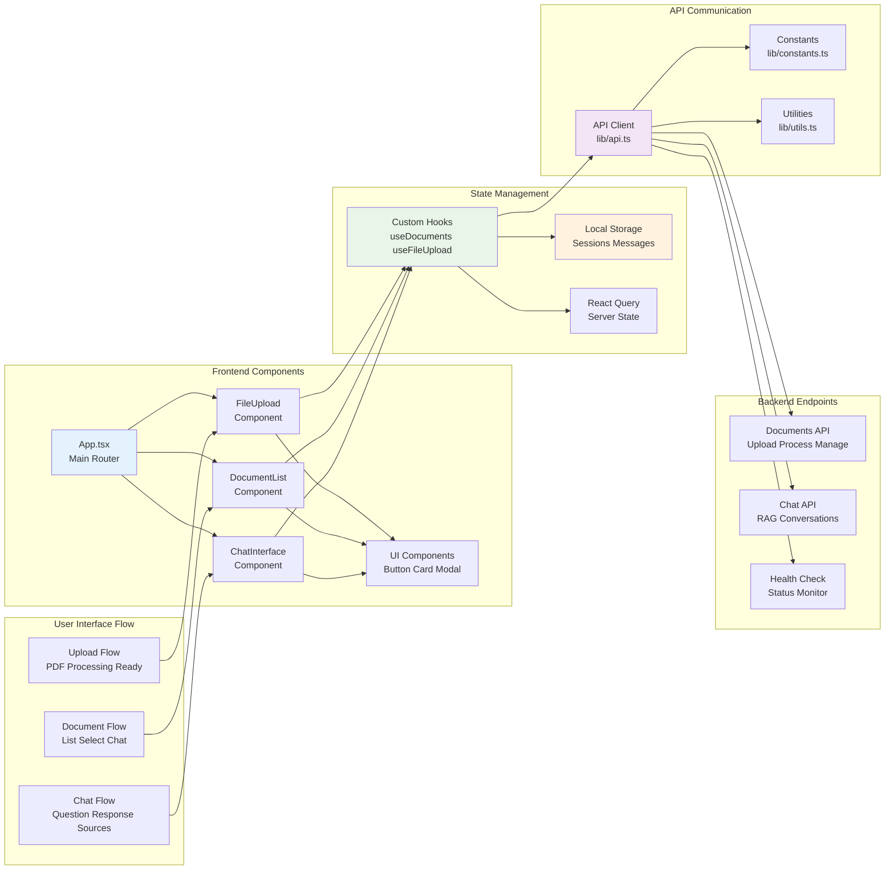

# Frontend Architecture

This document outlines the React-based frontend architecture, component structure, and state management patterns used in the Document Intelligence Platform.

## Component Architecture



## Core Components

### 1. Main Application (App.tsx)
Central component managing application state and routing:

```typescript
type ViewMode = "upload" | "documents" | "chat";

function App() {
  const [viewMode, setViewMode] = useState<ViewMode>("upload");
  const [selectedDocumentId, setSelectedDocumentId] = useState<string>();
  
  // Navigation and state management
  const handleUploadSuccess = () => setViewMode("documents");
  const handleDocumentSelect = (documentId: string) => {
    setSelectedDocumentId(documentId);
    setViewMode("chat");
  };
}
```

**Responsibilities:**
- **View Management**: Controls which interface is displayed
- **State Coordination**: Manages shared state between components  
- **Navigation**: Handles transitions between upload, documents, and chat views
- **Layout**: Provides consistent header and navigation structure

### 2. File Upload Component
Handles PDF document upload with validation and progress tracking:

```typescript
interface FileUploadProps {
  onUploadSuccess: () => void;
}

export function FileUpload({ onUploadSuccess }: FileUploadProps) {
  const { uploadFile, uploading, progress, error } = useFileUpload();
  
  const handleUpload = async (file: File) => {
    await uploadFile(file);
    onUploadSuccess();
  };
}
```

**Features:**
- **Drag & Drop**: Intuitive file selection
- **Validation**: PDF format and size limits (50MB)
- **Progress Tracking**: Real-time upload progress
- **Error Handling**: User-friendly error messages
- **Success Callbacks**: Integration with parent components

### 3. Document List Component
Displays uploaded documents with management capabilities:

```typescript
interface DocumentListProps {
  onDocumentSelect?: (documentId: string) => void;
}

export function DocumentList({ onDocumentSelect }: DocumentListProps) {
  const { documents, loading, error, refetch } = useDocuments();
  
  return (
    <div className="document-grid">
      {documents.map(doc => (
        <DocumentCard 
          key={doc.id}
          document={doc}
          onSelect={() => onDocumentSelect?.(doc.id)}
        />
      ))}
    </div>
  );
}
```

**Features:**
- **Document Grid**: Visual card-based layout
- **Status Indicators**: Processing status with color coding
- **Quick Actions**: View, chat, delete, summarize
- **Metadata Display**: File size, pages, tables, figures
- **Real-time Updates**: Automatic refresh of processing status

### 4. Chat Interface Component
Conversational interface with advanced messaging capabilities:

```typescript
interface ChatInterfaceProps {
  documentId?: string;
  conversationId?: string;
  className?: string;
}

export function ChatInterface({ documentId, className }: ChatInterfaceProps) {
  const [messages, setMessages] = useState<Message[]>([]);
  const [sessionId] = useState(() => generateSessionId());
  
  const handleSend = async (question: string) => {
    const response = await askQuestion({
      question,
      document_id: documentId,
      session_id: sessionId,
    });
    
    setMessages(prev => [...prev, userMessage, aiResponse]);
  };
}
```

**Features:**
- **Session Management**: Persistent conversation state
- **Source Attribution**: Clickable source references with page numbers
- **Conversation Starters**: Suggested questions for new users
- **Auto-resize**: Dynamic textarea height adjustment
- **Message History**: Local storage persistence
- **Typing Indicators**: Loading states during response generation

## State Management

### Custom Hooks

#### useDocuments Hook
Manages document list state and API interactions:

```typescript
export function useDocuments(): UseDocumentsReturn {
  const [documents, setDocuments] = useState<Document[]>([]);
  const [loading, setLoading] = useState(true);
  const [error, setError] = useState<string | null>(null);

  const fetchDocuments = async () => {
    const response = await getDocuments();
    setDocuments(transformDocuments(response.documents));
  };

  return { documents, loading, error, refetch: fetchDocuments };
}
```

#### useFileUpload Hook
Handles file upload logic with progress tracking:

```typescript
export function useFileUpload() {
  const [uploading, setUploading] = useState(false);
  const [progress, setProgress] = useState(0);
  const [error, setError] = useState<string | null>(null);

  const uploadFile = async (file: File) => {
    const formData = new FormData();
    formData.append('file', file);
    
    await uploadDocument(formData, {
      onUploadProgress: (progressEvent) => {
        const progress = Math.round(
          (progressEvent.loaded * 100) / progressEvent.total!
        );
        setProgress(progress);
      }
    });
  };

  return { uploadFile, uploading, progress, error };
}
```

### Local Storage Strategy

#### Session Persistence
- **Session IDs**: Unique identifiers for conversation continuity
- **Message History**: Conversation state across browser sessions
- **User Preferences**: Theme, language, display settings

```typescript
// Session management
const [sessionId, setSessionId] = useState<string>(() => {
  const stored = localStorage.getItem("chat-session-id");
  return stored || generateSessionId();
});

// Message persistence
useEffect(() => {
  localStorage.setItem(`chat-messages-${sessionId}`, JSON.stringify(messages));
}, [messages, sessionId]);
```

### React Query Integration
Server state management for API data:

```typescript
// Document fetching with React Query
const { data: documents, isLoading, error, refetch } = useQuery({
  queryKey: ['documents'],
  queryFn: getDocuments,
  staleTime: 30000, // 30 seconds
  cacheTime: 300000, // 5 minutes
});
```

## API Communication

### API Client Architecture
Centralized API communication with error handling:

```typescript
class APIError extends Error {
  constructor(
    public status: number,
    message: string,
    public details?: unknown
  ) {
    super(message);
  }
}

async function handleResponse<T>(response: Response): Promise<T> {
  if (!response.ok) {
    const errorData = await response.json().catch(() => ({}));
    throw new APIError(
      response.status,
      errorData.message || `HTTP ${response.status}`,
      errorData
    );
  }
  return response.json();
}
```

### Endpoint Functions
Type-safe API function definitions:

```typescript
export async function uploadDocument(formData: FormData): Promise<DocumentUploadResponse> {
  const response = await fetch(`${API_BASE_URL}/documents/upload`, {
    method: 'POST',
    body: formData,
  });
  
  return handleResponse<DocumentUploadResponse>(response);
}

export async function askQuestion(request: ChatRequest): Promise<ChatResponse> {
  const response = await fetch(`${API_BASE_URL}/chat/ask`, {
    method: 'POST',
    headers: { 'Content-Type': 'application/json' },
    body: JSON.stringify(request),
  });
  
  return handleResponse<ChatResponse>(response);
}
```

## UI Component System

### Design System
Consistent styling with Tailwind CSS and custom design tokens:

```typescript
// Design system constants
export const COLORS = {
  text: {
    primary: "text-gray-900",
    secondary: "text-gray-600",
    muted: "text-gray-500",
  },
  status: {
    success: "text-green-600",
    error: "text-red-600",
    warning: "text-yellow-600",
    info: "text-blue-600",
  }
};

export const SPACING = {
  padding: {
    xs: "px-3 py-1.5",
    sm: "px-4 py-2",
    md: "px-6 py-3",
    lg: "px-8 py-4",
  }
};
```

### Reusable UI Components
Shadcn-based component library:

```typescript
// Button component with variants
export interface ButtonProps extends React.ButtonHTMLAttributes<HTMLButtonElement> {
  variant?: "primary" | "secondary" | "outline" | "ghost" | "danger";
  size?: "sm" | "default" | "lg" | "icon";
}

// Card component for consistent layouts
export const Card = React.forwardRef<HTMLDivElement, React.HTMLAttributes<HTMLDivElement>>(
  ({ className = "", ...props }, ref) => (
    <div
      ref={ref}
      className={`rounded-xl border border-gray-200 bg-white shadow-sm ${className}`}
      {...props}
    />
  )
);
```

## Performance Optimizations

### Code Splitting
Lazy loading for better initial load times:

```typescript
const ChatInterface = lazy(() => import('./components/ChatInterface'));
const DocumentList = lazy(() => import('./components/DocumentList'));

// Usage with Suspense
<Suspense fallback={<LoadingSpinner />}>
  <ChatInterface documentId={selectedDocumentId} />
</Suspense>
```

### Memoization
Prevent unnecessary re-renders:

```typescript
const MessageItem = memo(({ message }: { message: Message }) => {
  return (
    <div className="message">
      <MessageContent content={message.content} />
      {message.sources && <SourceList sources={message.sources} />}
    </div>
  );
});
```

### Virtual Scrolling (Future Enhancement)
For large document lists and long conversations:

```typescript
// Future implementation for handling 1000+ documents
import { FixedSizeList as List } from 'react-window';

const VirtualizedDocumentList = ({ documents }: { documents: Document[] }) => (
  <List
    height={600}
    itemCount={documents.length}
    itemSize={120}
    itemData={documents}
  >
    {DocumentRow}
  </List>
);
```

## Development Workflow

### Build System
Vite for fast development and optimized builds:

```json
{
  "scripts": {
    "dev": "vite",
    "build": "tsc -b && vite build",
    "lint": "eslint .",
    "type-check": "tsc --noEmit",
    "preview": "vite preview"
  }
}
```

### Type Safety
Comprehensive TypeScript integration:

```typescript
// Strict type definitions for API responses
interface ChatResponse {
  answer: string;
  sources?: SourceReference[];
  conversation_id: string;
  session_id: string;
  timestamp: string;
}

// Component prop types
interface DocumentCardProps {
  document: Document;
  onSelect: (id: string) => void;
  onDelete?: (id: string) => void;
}
``` 
