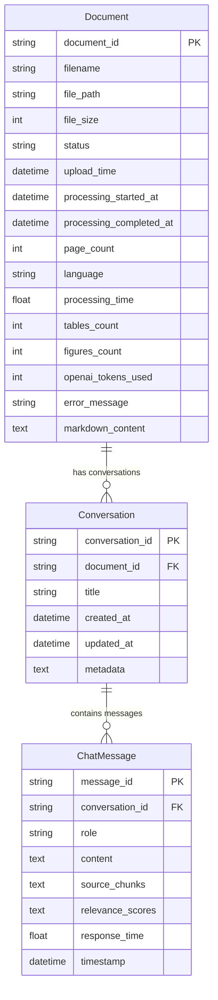

# Database Schema & API Architecture

This document describes the database schema, API endpoint structure, and data flow patterns used in the Document Intelligence Platform.

## Database Schema



## Database Models

### Document Model
Stores document metadata and processing information:

```python
class Document(SQLModel, table=True):
    document_id: str = Field(primary_key=True)
    filename: str
    file_path: str
    file_size: int
    status: str = Field(default=DocumentStatus.PENDING)
    
    # Timestamps
    upload_time: datetime = Field(default_factory=datetime.now)
    processing_started_at: Optional[datetime] = None
    processing_completed_at: Optional[datetime] = None
    
    # Content metadata
    page_count: int = Field(default=0)
    language: Optional[str] = None
    
    # Processing metrics
    processing_time: float = Field(default=0.0)
    tables_count: int = Field(default=0)
    figures_count: int = Field(default=0)
    openai_tokens_used: Optional[int] = None
    error_message: Optional[str] = None
    
    # Extracted content
    markdown_content: Optional[str] = None  # Serialized MarkdownDocument
```

**Status Values:**
- `PENDING`: Document uploaded, awaiting processing
- `PROCESSING`: Currently being processed by OpenAI Vision
- `COMPLETED`: Successfully processed and indexed
- `FAILED`: Processing failed with error message

### Conversation Model
Manages chat conversations tied to documents:

```python
class Conversation(SQLModel, table=True):
    conversation_id: str = Field(primary_key=True)
    document_id: str = Field(foreign_key="document.document_id")
    title: Optional[str] = None
    created_at: datetime = Field(default_factory=datetime.now)
    updated_at: datetime = Field(default_factory=datetime.now)
    metadata: Optional[str] = None  # JSON string for additional data
    
    # Relationships
    messages: List["ChatMessage"] = Relationship(back_populates="conversation")
```

**Special Document IDs:**
- `multi-doc`: Conversations spanning multiple documents
- Regular UUIDs: Single document conversations

### ChatMessage Model
Stores individual chat messages with source attribution:

```python
class ChatMessage(SQLModel, table=True):
    message_id: str = Field(primary_key=True)
    conversation_id: str = Field(foreign_key="conversation.conversation_id")
    role: str  # "user", "assistant", "system"
    content: str
    
    # Source attribution
    source_chunks: Optional[str] = None      # JSON array of chunk IDs
    relevance_scores: Optional[str] = None   # JSON array of scores
    
    # Performance metrics
    response_time: Optional[float] = None
    timestamp: datetime = Field(default_factory=datetime.now)
```

**Message Roles:**
- `user`: Human-generated questions and inputs
- `assistant`: AI-generated responses with sources
- `system`: System messages and notifications

## API Endpoints

### Documents API (`/api/v1/documents`)

#### Upload Document
```http
POST /api/v1/documents/upload
Content-Type: multipart/form-data

Request:
- file: PDF file (max 50MB)

Response:
{
  "document_id": "uuid-string",
  "filename": "document.pdf",
  "file_size": 1024000,
  "upload_time": "2024-01-15T10:30:00Z",
  "status": "processing",
  "message": "Upload successful - Processing started"
}
```

#### List Documents
```http
GET /api/v1/documents

Response:
{
  "documents": [
    {
      "document_id": "uuid-string",
      "filename": "document.pdf",
      "file_size": 1024000,
      "status": "completed",
      "upload_time": "2024-01-15T10:30:00Z",
      "page_count": 25,
      "tables_count": 3,
      "figures_count": 5,
      "processing_time": 45.2
    }
  ],
  "total_count": 1
}
```

#### Get Document Details
```http
GET /api/v1/documents/{document_id}

Response:
{
  "document_id": "uuid-string",
  "filename": "document.pdf",
  "status": "completed",
  "page_count": 25,
  "language": "en",
  "processing_time": 45.2,
  "openai_tokens_used": 15420,
  "markdown_content": "# Document Title\n\n## Section 1..."
}
```

#### Get Processing Status
```http
GET /api/v1/documents/{document_id}/status

Response:
{
  "document_id": "uuid-string",
  "status": "processing",
  "progress": 65,
  "current_page": 16,
  "total_pages": 25,
  "estimated_completion": "2024-01-15T10:35:00Z"
}
```

#### Delete Document
```http
DELETE /api/v1/documents/{document_id}

Response:
{
  "message": "Document deleted successfully",
  "document_id": "uuid-string"
}
```

#### Generate Summary
```http
POST /api/v1/documents/{document_id}/summary

Request:
{
  "summary_type": "brief",  // "brief", "detailed", "bullet_points", "executive"
  "include_key_points": true,
  "include_tables_summary": true,
  "include_figures_summary": true,
  "custom_instructions": "Focus on methodology"
}

Response:
{
  "summary": "This document presents a comprehensive analysis...",
  "key_points": [
    "Main finding 1",
    "Main finding 2"
  ],
  "tables_summary": "The document contains 3 tables showing...",
  "figures_summary": "5 figures illustrate the key concepts...",
  "word_count": 2500,
  "generation_time": 3.2
}
```

### Chat API (`/api/v1/chat`)

#### Ask Question
```http
POST /api/v1/chat/ask

Request:
{
  "question": "What are the main conclusions?",
  "document_id": "uuid-string",  // Optional: specific document
  "session_id": "user-session-123",
  "include_sources": true,
  "max_sources": 3,
  "search_mode": "hybrid"  // "hybrid", "dense", "sparse"
}

Response:
{
  "answer": "Based on the research findings, the main conclusions are...",
  "sources": [
    {
      "chunk_id": "chunk-uuid-1",
      "document_id": "doc-uuid",
      "document_name": "research_paper.pdf",
      "page_number": 15,
      "content": "The study concludes that...",
      "relevance_score": 0.95,
      "chunk_index": 127
    }
  ],
  "conversation_id": "conv-uuid",
  "session_id": "user-session-123",
  "response_time": 2.3,
  "timestamp": "2024-01-15T10:30:00Z"
}
```

#### Refresh RAG System
```http
POST /api/v1/chat/refresh-rag

Response:
{
  "message": "RAG system refreshed successfully",
  "rag_ready": true,
  "has_documents": true,
  "indexed_documents": 15,
  "total_chunks": 2847
}
```

#### Get System Status
```http
GET /api/v1/chat/status

Response:
{
  "rag_ready": true,
  "has_documents": true,
  "indexed_documents": 15,
  "total_chunks": 2847,
  "vector_db_status": "healthy",
  "last_refresh": "2024-01-15T10:00:00Z"
}
```

### Health Check API

#### Application Health
```http
GET /health

Response:
{
  "status": "healthy",
  "timestamp": "2024-01-15T10:30:00Z",
  "services": {
    "database": "healthy",
    "vector_db": "healthy",
    "openai_api": "healthy",
    "file_system": "healthy"
  },
  "metrics": {
    "total_documents": 15,
    "total_conversations": 47,
    "total_messages": 234,
    "uptime_seconds": 86400
  }
}
```

## Data Transfer Objects (DTOs)

### Request Models

#### ChatRequest
```python
class ChatRequest(BaseModel):
    question: str = Field(min_length=1, max_length=1000)
    document_id: Optional[str] = None
    session_id: Optional[str] = None
    include_sources: bool = True
    max_sources: int = Field(default=3, ge=1, le=10)
    search_mode: str = Field(default="hybrid")
```

#### SummaryRequest
```python
class SummaryRequest(BaseModel):
    summary_type: str = Field(default="brief")
    include_key_points: bool = True
    include_tables_summary: bool = True
    include_figures_summary: bool = True
    custom_instructions: Optional[str] = None
```

### Response Models

#### DocumentUploadResponse
```python
class DocumentUploadResponse(BaseModel):
    document_id: str
    filename: str
    file_size: int
    upload_time: datetime
    status: str
    message: str
```

#### ChatResponse
```python
class ChatResponse(BaseModel):
    answer: str
    sources: Optional[List[SourceReference]] = None
    conversation_id: str
    session_id: str
    response_time: float
    timestamp: datetime
```

#### SourceReference
```python
class SourceReference(BaseModel):
    chunk_id: str
    document_id: str
    document_name: str
    page_number: int
    content: str
    relevance_score: float
    chunk_index: int
```

## Error Handling

### Custom Exception Classes

```python
class DocumentIntelligenceError(Exception):
    def __init__(self, message: str, error_code: str, status_code: int = 500):
        self.message = message
        self.error_code = error_code
        self.status_code = status_code

class DocumentNotFoundError(DocumentIntelligenceError):
    def __init__(self, document_id: str):
        super().__init__(
            f"Document {document_id} not found",
            ErrorCodes.DOCUMENT_NOT_FOUND,
            404
        )

class DocumentProcessingError(DocumentIntelligenceError):
    def __init__(self, message: str, document_id: str):
        super().__init__(
            f"Processing error for document {document_id}: {message}",
            ErrorCodes.PROCESSING_FAILED,
            500
        )
```

### Error Response Format
```json
{
  "success": false,
  "error_code": "DOCUMENT_NOT_FOUND",
  "message": "Document uuid-123 not found",
  "timestamp": "2024-01-15T10:30:00Z",
  "details": {
    "document_id": "uuid-123",
    "requested_operation": "get_document"
  }
}
```

## Security & Validation

### Request Validation
- **File Upload**: MIME type validation, size limits, virus scanning
- **Input Sanitization**: XSS prevention, SQL injection protection
- **Rate Limiting**: API endpoint throttling
- **CORS**: Configured for frontend origins only

### Data Privacy
- **File Storage**: Local filesystem with restricted access
- **Database**: SQLite with encrypted connections
- **API Keys**: Environment variable storage only
- **Session Management**: UUID-based session identification

## Performance Considerations

### Database Optimization
- **Indexes**: Primary keys, foreign keys, status fields
- **Connection Pooling**: SQLModel with optimized pool settings
- **Query Optimization**: Efficient joins and selective loading

### API Performance
- **Async Operations**: FastAPI with async/await patterns
- **Background Tasks**: Document processing in background
- **Caching**: Response caching for expensive operations
- **Pagination**: Large result set pagination support

### Vector Database Integration
- **Qdrant Client**: Optimized for hybrid search operations
- **Batch Operations**: Bulk indexing for efficiency
- **Memory Management**: Efficient vector storage and retrieval 
